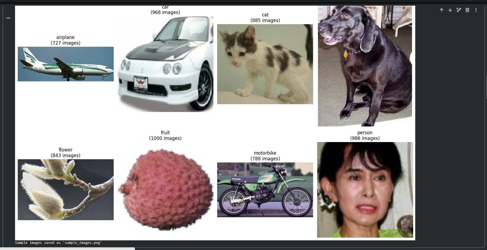
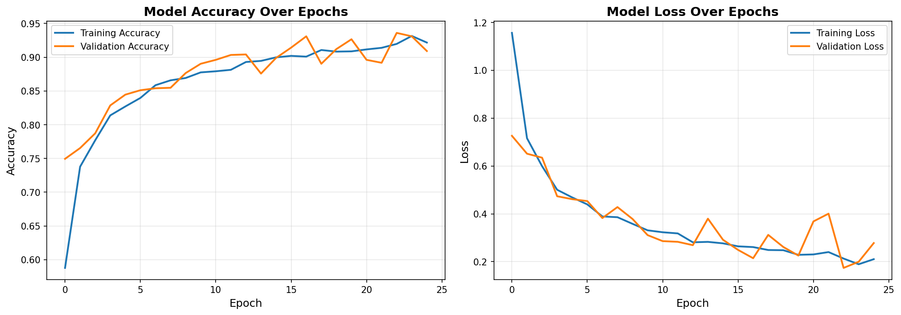
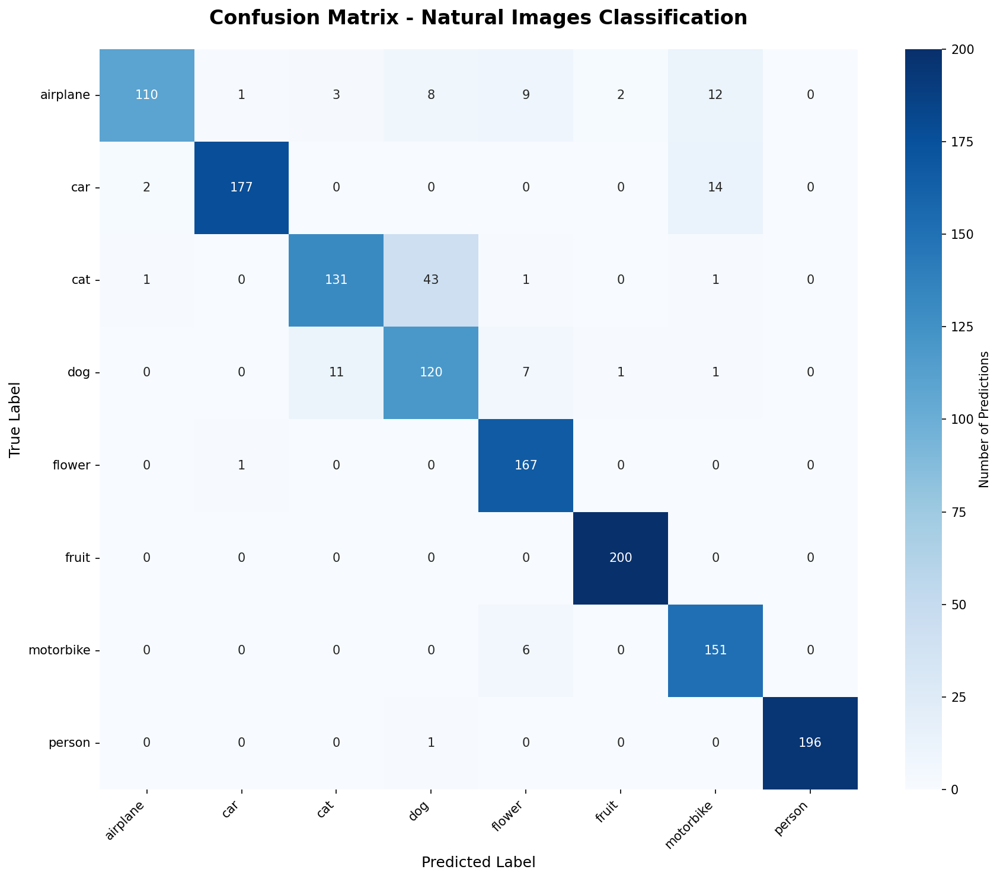
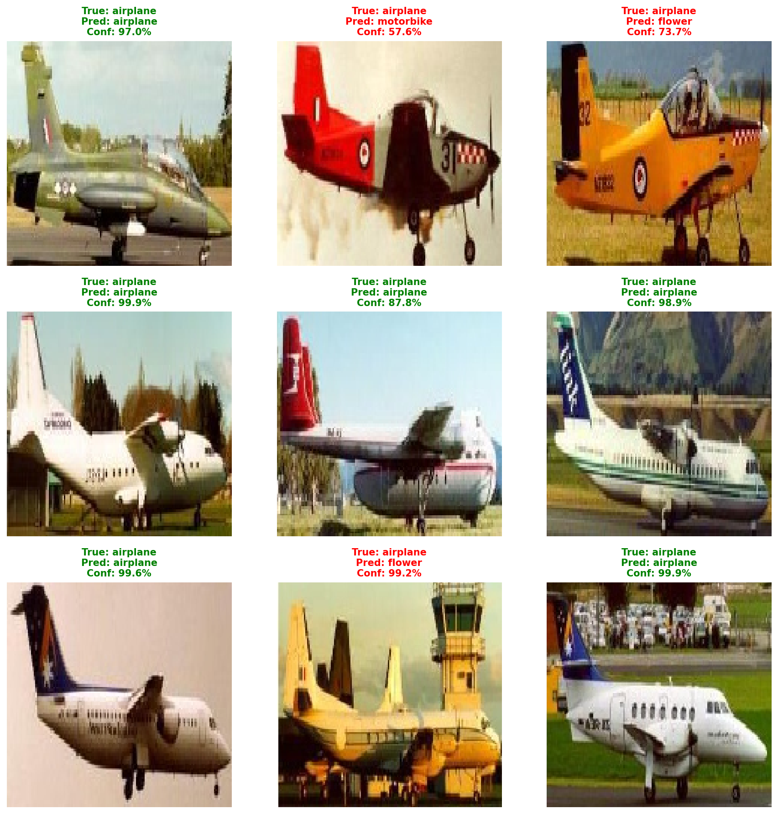

# Natural Images Classification using CNN

A deep learning project implementing a Convolutional Neural Network (CNN) to classify natural images into 8 categories.

## Project Overview

This project uses a custom CNN architecture to classify images from the Natural Images dataset into the following categories:
- Airplane
- Car
- Cat
- Dog
- Flower
- Fruit
- Person
- Motorbike

**Course:** CECS 456 - Machine Learning  
**Author:** Lisseth Zamora  
**Date:** Dec.15 2025

---

## Dataset

**Source:** [Natural Images Dataset on Kaggle](https://www.kaggle.com/datasets/prasunroy/natural-images)

**Statistics:**
- Total images: ~6,899
- Number of classes: 8
- Image type: RGB color photos
- Image sizes: Variable (resized to 150×150 for training)

**Dataset Structure:**
```
natural_images/
├── airplane/
├── car/
├── cat/
├── dog/
├── flower/
├── fruit/
├── person/
└── motorbike/
```

---

## Model Architecture

### CNN Architecture
- **Input:** 150×150×3 RGB images
- **Convolutional Blocks:** 4 blocks with progressively increasing filters (32 → 64 → 128 → 128)
- **Pooling:** MaxPooling after each conv block
- **Regularization:** Dropout (50%) to prevent overfitting
- **Output:** 8-class softmax layer

### Model Summary
```
Layer Type          Output Shape         Parameters
================================================================
Conv2D              (None, 150, 150, 32)   896
MaxPooling2D        (None, 75, 75, 32)     0
Conv2D              (None, 75, 75, 64)     18,496
MaxPooling2D        (None, 37, 37, 64)     0
Conv2D              (None, 37, 37, 128)    73,856
MaxPooling2D        (None, 18, 18, 128)    0
Conv2D              (None, 18, 18, 128)    147,584
MaxPooling2D        (None, 9, 9, 128)      0
Flatten             (None, 10368)          0
Dropout             (None, 10368)          0
Dense               (None, 512)            5,308,928
Dropout             (None, 512)            0
Dense               (None, 8)              4,104
================================================================
Total params: 5,553,864
Trainable params: 5,553,864
```

---

## How to Run

### Prerequisites
```bash
tensorflow>=2.10.0
keras
numpy
matplotlib
seaborn
scikit-learn
```

### Google Colab
1. Upload `natural_images_cnn_project.ipynb` to Google Colab
2. Enable GPU: Runtime → Change runtime type → GPU
3. Download the dataset from Kaggle
4. Run all cells sequentially
5. Wait for training to complete (~15-20 minutes)


---

## Results

### Training Performance
- **Training Accuracy:** XX.XX%
- **Validation Accuracy:** XX.XX%
- **Training Loss:** X.XXXX
- **Validation Loss:** X.XXXX

### Per-Class Performance
| Class      | Precision | Recall | F1-Score | Accuracy |
|------------|-----------|--------|----------|----------|
| Airplane   | 0.XX      | 0.XX   | 0.XX     | XX.XX%   |
| Car        | 0.XX      | 0.XX   | 0.XX     | XX.XX%   |
| Cat        | 0.XX      | 0.XX   | 0.XX     | XX.XX%   |
| Dog        | 0.XX      | 0.XX   | 0.XX     | XX.XX%   |
| Flower     | 0.XX      | 0.XX   | 0.XX     | XX.XX%   |
| Fruit      | 0.XX      | 0.XX   | 0.XX     | XX.XX%   |
| Person     | 0.XX      | 0.XX   | 0.XX     | XX.XX%   |
| Motorbike  | 0.XX      | 0.XX   | 0.XX     | XX.XX%   |

*Note: Fill in actual values after running the model*

---

##  Visualizations

### Sample Images from Each Class


### Training Progress


### Confusion Matrix


### Sample Predictions


---

##  Key Findings

### What Worked Well
- Data augmentation improved generalization
- Four-layer CNN architecture balanced complexity and training time
- Dropout regularization prevented overfitting
- Classes with distinctive features (airplanes, flowers) achieved high accuracy

### Challenges
- Cats and dogs were occasionally confused due to similar features
- Person class showed high variance due to diverse poses and clothing
- Limited training data for some classes

### Potential Improvements
1. **Transfer Learning:** Use pre-trained models (ResNet, MobileNet)
2. **More Data:** Collect additional images for underperforming classes
3. **Hyperparameter Tuning:** Optimize learning rate, batch size, architecture
4. **Advanced Techniques:** 
   - Learning rate scheduling
   - Early stopping
   - Batch normalization
   - Ensemble methods

---

## Technologies Used

- **Python 3.9+**
- **TensorFlow/Keras:** Deep learning framework
- **NumPy:** Numerical computations
- **Matplotlib/Seaborn:** Visualization
- **Scikit-learn:** Evaluation metrics
- **Google Colab:** GPU-accelerated training

---

## Repository Structure

```
natural-images-classification/
│
├── natural_images_cnn_project.ipynb    # Main notebook
├── README.md                           # This file
├── QUICK_START_GUIDE.md               # Detailed setup guide
├── requirements.txt                    # Python dependencies
│
├── images/                            # Generated visualizations
│   ├── sample_images.png
│   ├── training_results.png
│   ├── confusion_matrix.png
│   └── sample_predictions.png
│
└── models/                            # Saved models
    └── natural_images_cnn_model.h5
```

---

**Last Updated:** [Current Date]
